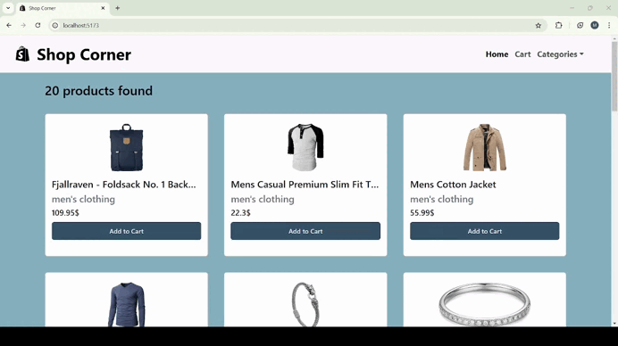

# E-commerce Website with React - Shop Corner
This is a dynamic e-commerce platform, which users can filter and explore products by their categories, and update product quantities, remove items, and see total prices in the cart.
# 🛠️ Technologies Used:
Frontend: React.js, React Router, Bootstrap

Reusable Components for maintainability

Context API for state management

API Integration: Axios

Number Formatting: Millify 

Notifications: React Toastify

Loader Animation

Responsive Design: Modern and intuitive UI/UX

# What I learned from this project

The key features of this project is using High Order Components (HOCs) to simplify and reuse common logic across multiple components. This learned me to make the code cleaner, more consistent, and easier to maintain.
With this project, I improved my skills in integrating APIs, managing state, using different libraries and building responsive and feature-rich web applications with React. 

# Preview of the Project

